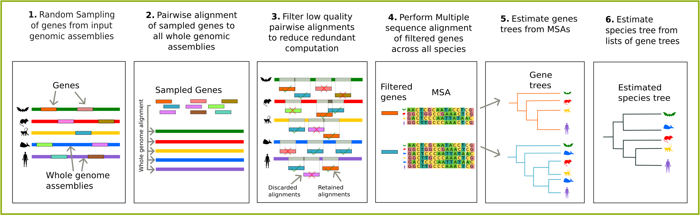

<div align="center">
    
# Reference-free Orthology-free Annotation-free DIscordance aware Estimation of Species tree (ROADIES)

[license-badge]: https://img.shields.io/badge/License-MIT-yellow.svg 
[license-link]: https://github.com/TurakhiaLab/ROADIES/blob/main/LICENSE

[![License][license-badge]][license-link]
[](https://github.com/TurakhiaLab/ROADIES/actions)
[](https://snakemake.readthedocs.io/en/v7.19.1/index.html)
[](http://bioconda.github.io/recipes/roadies/README.html)
[](https://hub.docker.com/r/ang037/roadies)
[](https://doi.org/10.1073/pnas.2500553122)
[](https://doi.org/10.5061/dryad.tht76hf73)
[](https://youtu.be/1sR741TvZnM?si=vVNAnonvzNEzrLKq)

<div align="center">


</div>

</div>

## Table of Contents
- [Introduction](#overview)
- [Quick Install](#usage)
    - [Option 1: Install via Bioconda (Recommended)](#conda)
    - [Option 2: Install via DockerHub](#dockerhub)
    - [Option 3: Install via Local Docker Build](#docker)
    - [Option 4: Install via Source Script](#script)
- [Quick Start](#start)
- [Running ROADIES on your own data](#runpipeline)
- [Citing ROADIES](#citation)

<br>

## <a name="overview"></a> Introduction

Welcome to the official repository of ROADIES, a novel pipeline for inferring phylogenetic species trees directly from raw genomic assemblies. ROADIES offers a fully automated, scalable, and easy-to-use solution, eliminating manual steps and allowing flexible control over the trade-off between accuracy and runtime.

### 🟡 For a detailed overview of ROADIES' features and configuration options, please visit our [Wiki](https://turakhialab.github.io/ROADIES/).

### 🟡 If you encounter issues while running the pipeline, please refer to [this page](https://turakhialab.github.io/ROADIES/troubleshooting/) for common errors and troubleshooting tips.
<br>

<div align="center">

  <figure>
    
    <figcaption>Figure: ROADIES Pipeline Stages</figcaption>
  </figure>

</div>

<br>

## <a name="usage"></a> Quick Install

Please follow any of the options below to install ROADIES in your system. 

### <a name="conda"></a> Option 1: Install via Bioconda (Recommended)

**Step 1:** Install Conda (if not installed):

```bash
wget https://repo.anaconda.com/miniconda/Miniconda3-latest-Linux-x86_64.sh
chmod +x Miniconda3-latest-Linux-x86_64.sh
./Miniconda3-latest-Linux-x86_64.sh

export PATH="$HOME/miniconda3/bin:$PATH"
source ~/.bashrc
```

**Step 2:** Configure Conda channels:

```bash
conda config --add channels defaults
```
```bash
conda config --add channels bioconda
```
```bash
conda config --add channels conda-forge
```

Verify the installation by running `conda` in your terminal

**Step 3:** Create and activate a custom environment:

```bash
conda create -n roadies_env python=3.9 ete3 seaborn
```
```bash
conda activate roadies_env
```

**Step 4:** Install ROADIES:

```bash
conda install roadies=0.1.10
```

**Step 5:** Locate the installed files:

```bash
cd $CONDA_PREFIX/ROADIES
```
Now, you will be able to find the contents of the repository within this ROADIES folder.

**Step 6:** Run the following commands:

```bash
git clone https://github.com/smirarab/pasta.git
git clone https://github.com/smirarab/sate-tools-linux.git
cd pasta
python3 setup.py develop --user
```

Also, in the `align.smk` file (inside the `workflow/rules` directory of the ROADIES repository), please replace any instance of:

- `pasta.py` with `python pasta/run_pasta.py`
- `run_seqtools.py` with `python pasta/run_seqtools.py`

After following all these steps, now you are ready to follow the [Quick Start](#start) section to run the pipeline. Make sure to go back to the main directory to follow the next steps:

```bash
cd ROADIES
```

### <a name="dockerhub"></a> Option 2: Install via DockerHub

If you would like to install ROADIES using DockerHub, follow these steps:

**Step 1:** Pull the ROADIES image from DockerHub:

```bash
docker pull ang037/roadies:latest
```
**Step 2:** Launch a container:

```bash
docker run -it ang037/roadies:latest
```

These commands will launch the Docker container in interactive mode, with the `roadies_env` environment activated and the working directory set to the ROADIES repository containing all necessary files. Once you are able to access the ROADIES repository, refer to the [Quick Start](#start) to run the pipeline. 

### <a name="docker"></a> Option 3: Install via Local Docker Build

**Step 1:** Clone the ROADIES repository:

```bash
git clone https://github.com/TurakhiaLab/ROADIES.git
```
```bash
cd ROADIES
```

**Step 2:** Build and run the Docker container:

```bash
docker build -t roadies_image .
```
```bash
docker run -it roadies_image
```

Once you are able to access the ROADIES repository, refer to [Quick Start](#start) instructions to run the pipeline. 

### <a name="script"></a> Option 4: Install via Source Script

**Step 1:** Install the following dependencies (**requires sudo access**):

- Java Runtime Environment (Version 1.7 or higher)
- Python (Version 3.9 or higher)
- `wget` and `unzip` commands
- GCC (Version 11.4 or higher)
- cmake (Download here: https://cmake.org/download/)
- Boost library (Download here: https://boostorg.jfrog.io/artifactory/main/release/1.82.0/source/)
- zlib (Download here: http://www.zlib.net/)

For Ubuntu, you can install these dependencies with: 

```bash
sudo apt-get install -y wget unzip make g++ python3 python3-pip python3-setuptools git default-jre libgomp1 libboost-all-dev cmake
```

**Step 2:** Clone the repository:

```bash
git clone https://github.com/TurakhiaLab/ROADIES.git
```
```bash
cd ROADIES
```

**Step 3:** Run the installation script:

```bash
chmod +x roadies_env.sh
```
```bash
source roadies_env.sh
```

After successful setup (Setup complete message), your environment `roadies_env` will be activated. Proceed to [Quick Start](#start).

**Note:** If you encounter issues with the Boost library, add its path to `$CPLUS_LIBRARY_PATH` and save it in `~/.bashrc`.

<br>

## <a name="start"></a> Quick Start

After installing using one of the options mentioned in [Quick Install](#usage), you're ready to run ROADIES! To get started:

**Step 1:** Download the test dataset (11 Drosophila genomes) (make sure to perform this step from the main repository directory):

```bash
mkdir -p test/test_data && cat test/input_genome_links.txt | xargs -I {} sh -c 'wget -O test/test_data/$(basename {}) {}'
```

This will save the datasets on a separate `test/test_data` folder within the repository

**Step 2:** Run the ROADIES pipeline

#### IMPORTANT: ROADIES by default runs multiple iterations for generating highly accurate trees. For quick testing, use `--noconverge` to run a single iteration.

**Full run (multiple iterations) - Default**
```bash
python run_roadies.py --cores 16 
```
**OR**

**Quick test run (one iteration)**
```bash
python run_roadies.py --cores 16 --noconverge 
```

**Step 3:** Access final species tree

**Default mode:**
Final species tree (in Newick format) for individual iterations (latest one will be the most confident and accurate tree) will be saved in separate `converge_files/iteration_<iteration_number>` folders.

**If `--noconverge` is used:**
Final species tree (in Newick format) will be saved as `roadies.nwk` in a separate `output_files` folder. 

#### NOTE: ROADIES outputs unrooted trees by default. You can reroot trees on your own or use the provided `reroot.py` script in `workflow/scripts/` (given a reference rooted species tree as input). 

<br>

## <a name="runpipeline"></a> Running ROADIES on your own data

If you want to run ROADIES with your own datasets, follow these steps:

**Step 1:** Specify Input Dataset:

- Edit `config.yaml` file (found in the ROADIES directory - `config` folder).
- Update the `GENOMES` field with paths to your `.fa` or `.fa.gz` genome assemblies. Ensure all input genomic assemblies are in `.fa` or `.fa.gz` format and named according to the species' name (e.g., `Aardvark.fa`). 

**IMPORTANT**: Each file must contain only one species. If needed, split multi-species files with:

```bash
faSplit byname <input_dir> <output_dir>
```

**Step 2:** Configure Other Parameters: 

- Modify other parameters in `config.yaml` as needed.
- Refer to detailed settings on the [Wiki](https://turakhialab.github.io/ROADIES/).

**Step 3:** Run the Pipeline: 

```bash
python run_roadies.py --cores 16
```

**Modes of operation**: ROADIES supports multiple modes of operation (`fast`, `balanced`, `accurate`) by controlling the accuracy-runtime tradeoff. Use any one of the following commands to select a mode (`accurate` mode is the default):


```bash
python run_roadies.py --cores 16 --mode accurate
```
```bash
python run_roadies.py --cores 16 --mode balanced
```
```bash
python run_roadies.py --cores 16 --mode fast
```

Final unrooted species tree (in Newick format) for individual iterations (latest one will be the most confident and accurate tree) will be saved in separate `ALL_OUT_DIR/iteration_<iteration_number>` folders (`ALL_OUT_DIR` is configured in `config/config.yaml`). 

### For contributing to the code, or SLURM cluster usage, refer to [Wiki](https://turakhialab.github.io/ROADIES/contribution)

<br>

## <a name="citation"></a> Citing ROADIES

If you use ROADIES in your research or publications, please cite the following paper:

A. Gupta, S. Mirarab, & Y. Turakhia, Accurate, scalable, and fully automated inference of species trees from raw genome assemblies using ROADIES, Proc. Natl. Acad. Sci. U.S.A. 122 (19) e2500553122, [https://doi.org/10.1073/pnas.2500553122](https://doi.org/10.1073/pnas.2500553122) (2025).

### Accessing ROADIES output files

The output files with the gene trees and species trees generated by ROADIES in the manuscript are deposited to [Dryad](https://datadryad.org/stash). To access it, please refer to the following:

Gupta, Anshu; Mirarab, Siavash; Turakhia, Yatish (2024). Accurate, scalable, and fully automated inference of species trees from raw genome assemblies using ROADIES [Dataset]. Dryad. [https://doi.org/10.5061/dryad.tht76hf73](https://doi.org/10.5061/dryad.tht76hf73).


