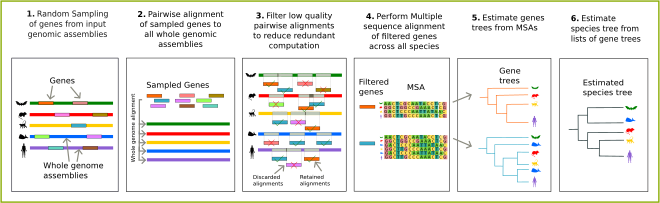

<div align="center">


# Reference free Orthology free Alignment free DIscordant Aware Estimation of Species Tree (ROADIES)

</div>

## Table of Contents
- [Introduction](#overview)
- [Environment Setup](#gettingstarted) 
- [Using ROADIES](#usage)
  - [Step1: Configuring parameters](#configuration)
  - [Step2: Running the pipeline](#run)
  - [Step3: Analyzing output files](#output)
- [Example run](#example)
- [Contributions and Support](#support)
- [Citing ROADIES](#citation)

## <a name="overview"></a> Introduction

Welcome to the official repository of ROADIES, a novel pipeline designed for phylogenetic tree inference of the species directly from their raw genomic assemblies. Our pipeline offers a fully automated, easy-to-use, scalable solution, eliminating any error-prone manual steps and providing unique flexibility in adjusting the tradeoff between accuracy and runtime. 
<br>
#### Key Features
- **Automation**: ROADIES automates the process of species tree inference without requiring any intermediate gene annotations or orthologous groups, making it effortless for users to generate accurate species trees.
- **Scalability**: ROADIES handles both small-scale and large-scale datasets efficiently, including diverse life forms such as mammals, flies, and birds. ROADIES also scales efficiently with multiple cores and produces faster results.
- **Reference Free**: ROADIES ensures unbiased results by eliminating reference bias, enabling accurate species tree inference by randomly sampling genes from raw genome assemblies.
- **Flexibility**: ROADIES allows users to tune the tradeoff between accuracy and runtime by configuring the parameters and tailoring the pipeline to their specific needs.
- **Debugging options**: ROADIES provides multiple plots as output for graphical analysis, making it easier for the user to debug. 

#### ROADIES Pipeline Overview
ROADIES pipeline consists of multiple stages, from raw genome assemblies to species tree estimation, with several user-configurable parameters in each stage. ROADIES randomly samples subsequences from input genomic assemblies as genes which are then aligned with all individual assemblies using [LASTZ](https://lastz.github.io/lastz/). Next, ROADIES filters the alignments, gathers all homology data per gene, and performs multiple sequence alignments for every gene using [PASTA](https://github.com/smirarab/pasta). Lastly, ROADIES estimates gene trees from MSA using [IQTREE](http://www.iqtree.org/) and eventually estimates species trees from gene trees using [ASTRAL-Pro](https://github.com/chaoszhang/A-pro). 

<div align="center">



</div>

## <a name="gettingstarted"></a> Environment Setup

This section provides detailed instructions on how to install and set up the environment to run ROADIES in your system.

ROADIES is built on Snakemake (workflow parallelization tool). It also requires various tools (PASTA, LASTZ, IQTREE, ASTRAL-Pro) to be installed before performing the analysis. To ease the process, instead of individually installing the tools, we provide a script to automatically download all dependencies into the user system. 

### Linux user

Execute bash script `roadies_env.sh` by following the commands below:

```
chmod +x roadies_env.sh
./roadies_env.sh
```
This will install and build all required tools and dependencies required by the user to get started. Once setup is complete, it will print "Setup complete" in the terminal. On its completion, a snakemake environment named "roadies_env" will be activated with all conda packages installed in it. 

## <a name="usage"></a> Using ROADIES

This section provides detailed instructions on how to configure, run, and analyze the output of ROADIES for species tree inference. Once the required environment setup process is complete, follow the steps below for using ROADIES.

### <a name="configuration"></a> Step 1: Configuring parameters

ROADIES provides multiple options for the user to configure the pipeline specific to their requirements before running the pipeline. Following is the list of available input configurations, provided in `config/config.yaml` (Note: ROADIES has default values for some of the parameters that give the best results, users can modify the values specific to their needs).

| Parameters | Description | Default value |
| --- | --- | --- |
| **GENOMES** | Specify the path to your input files which includes raw genome assembiles of the species. All input genome assemblies should be in fasta format. The genome assembly files should be named according to the species' names (for example, Aardvark's genome assembly to be named as `Aardvark.fa`). Each file should contain the genome assembly of one unique species. If a file contains multiple species, split it into individual genome files (fasplit can be used for this: `faSplit byname <input_dir> <output_dir>`)| |
| **REFERENCE** | Specify path for the reference tree in Newick format. This is useful to compare ROADIES' results with a state-of-the-art approach. | |
| **LENGTH** | Configure the lengths of each of the randomly sampled subsequence or genes. | 500 |
| **GENE_COUNT** | Configure the number of genes to be sampled across all input genome assemblies. | 100 |
| **UPPER_CASE** | Configure the lower limit threshold of upper cases for valid sampling. ROADIES samples the genes only if the percentage of upper cases in each gene is more than this value. | 0.9 |
| **OUT_DIR** | Specify the path for output files. | |
| **MIN_ALIGN** | Specify the minimum number of allowed species to exist in gene fasta files after LASTZ. This parameter is used for filtering gene fasta files which has very less species representation. It is recommended to set the value more than the default value since ASTRAL-Pro follows quartet-based topology for species tree inference. | 4 |
| **COVERAGE** | Set the percentage of input sequence included in the alignment for LASTZ. | 85 (Recommended) |
| **CONTINUITY** | Define the allowable percentage of non-gappy alignment columns. | 85 (Recommended) |
| **IDENTITY** | Set the percentage of the aligned base pairs. | 65 (Recommended) | 
| **MAX_DUP** | | |
| **STEPS** |||
| **NUM_BOOTSTRAP** |||
| **INPUT_GENE_TREES** |||
| **INPUT_MAP** |||
| **ITERATIONS** | Provide the number of iterations for ROADIES to run. Set high value only if you we want to run the pipeline longer to generate accurate results.||
| **WEIGHTED**  |||
| **TO_ALIGN** | Specify the number of species in the input dataset. ||
| **FILTERFRAGMENTS** | Specify the percentage of the allowed gaps in a fragments. With more gaps, the fragments will be filtered. ||
| **MASKSITES** | Specify the percentage of the allowed gaps in specific sites of PASTA alignment. If there are more gaps than the specified percentage value, the sites will be masked.||
| **MSA** |||
| **CORES** |||

### <a name="run"></a> Step 2: Running the pipeline

Once the required installations are completed, and the pipeline is configured, execute the following command:

```
python workflow/scripts/2converge.py --cores [number of cores]
```

### <a name="output"></a> Step 3: Analyzing output files

After the pipeline finishes running, you can analyze the output files (along with all intermediate output files for each stage of the pipeline) saved in a separate `results` folder mentioned in `--OUT_DIR` parameter containing the following subfolders:

- `alignments` - contains the sampled output of each species in `<species_name>.maf` format generated by the sampling step
- `genes`- contains the fasta files of all highest scoring genes which is filtered after LASTZ step in `gene_<id>.fa` format
- `geneTree` - contains all gene trees merged together in a single `gene_tree_merged.nwk` file 
- `msa`- contains the MSA filtered output for all gene fasta files in `gene_aln_<id>.fa` format
- `plots` - 
- `samples` - 
- `statistics`- contains the list of input species in `num_genes.csv`, number of gene trees in `num_gt.txt`, number of homologues with corresponding genes in `homologues.csv`

## <a name="example"></a> Example run

To help you get started with ROADIES, we provide an example command below. By default, `--GENOMES` points to 48 Avian species datasets and `--MAX_ITER` is set to 50. To execute our pipeline with 16 cores and 16 jobs in parallel, run
```
python workflow/scripts/converge.py --cores 16 --jobs 16
```
This command will execute the converge script to iterate ROADIES 50 times and estimates phylogeny of 48 Avian species. It takes around XXX hours to complete the execution. The output files will be saved in separate `results` directory. The final inferred species tree in Newick format will be saved as `roadies.nwk` file in the same directory.

## <a name="support"></a> Contributions and Support

We welcome contributions from the community to enhance the capabilities of ROADIES. If you encounter any issues or have suggestions for improvement, please open an issue on GitHub. For general inquiries and support, reach out to our team.

## <a name="citation"></a> Citing ROADIES

If you use the ROADIES pipeline for species tree inference in your research or publications, we kindly request that you cite the following paper:


