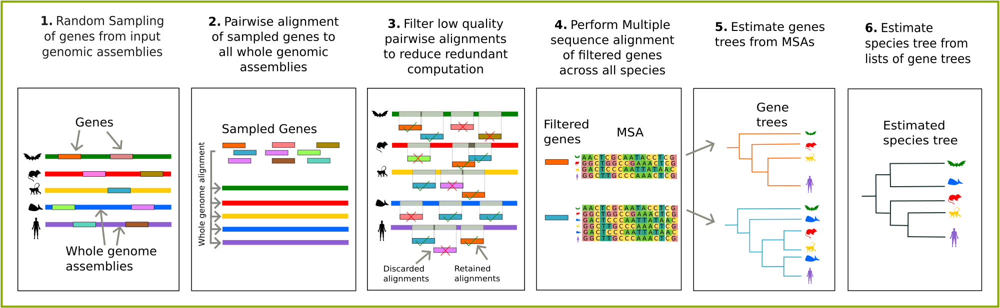

<div align="center">
    
# Reference-free Orthology-free Annotation-free DIscordance aware Estimation of Species tree (ROADIES)

[license-badge]: https://img.shields.io/badge/License-MIT-yellow.svg 
[license-link]: https://github.com/TurakhiaLab/ROADIES/blob/main/LICENSE

[![License][license-badge]][license-link]
[](https://github.com/TurakhiaLab/ROADIES/actions)
[](https://snakemake.readthedocs.io/en/v7.19.1/index.html)
[](http://bioconda.github.io/recipes/roadies/README.html)
[](https://hub.docker.com/r/ang037/roadies)
[](https://doi.org/10.1073/pnas.2500553122)
[](https://doi.org/10.5061/dryad.tht76hf73)
[](https://youtu.be/1sR741TvZnM?si=vVNAnonvzNEzrLKq)

<div align="center">


</div>

</div>

## Table of Contents
- [Introduction](#overview)
- [Quick Install](#usage)
- [Quick Start](#start)
- [Running ROADIES on your own data](#runpipeline)
- [ROADIES_XP: Placement Mode & GPU Acceleration](#xp)
- [Citing ROADIES](#citation)

<br>

## <a name="overview"></a> Introduction

ROADIES is a fully automated, scalable pipeline for inferring phylogenetic species trees directly from raw genomic assemblies, eliminating manual steps and giving flexible control over the accuracy/runtime trade-off.

**ROADIES_XP** extends ROADIES with GPU-accelerated alignment/tree-building and a *placement* mode for growing or updating an existing species tree with new genomes, without recomputing it from scratch — see [ROADIES_XP](#xp) below. It's opt-in; de novo tree inference (the original PNAS pipeline) remains the default.

### 🟡 For a detailed overview of ROADIES' features and configuration options, please visit our [Wiki](https://turakhialab.github.io/ROADIES/).

### 🟡 If you encounter issues while running the pipeline, please refer to [this page](https://turakhialab.github.io/ROADIES/troubleshooting/) for common errors and troubleshooting tips.
<br>

<div align="center">

  <figure>
    
    <figcaption>Figure: ROADIES Pipeline Stages</figcaption>
  </figure>

</div>

<br>

## <a name="usage"></a> Quick Install

Four ways to install ROADIES — pick one. Full step-by-step instructions (including troubleshooting notes) for every option are on the [Install wiki page](https://turakhialab.github.io/ROADIES/install/).

**Option 1: Bioconda (recommended)**
```bash
conda create -n roadies_env -c bioconda -c conda-forge python=3.9 ete3 seaborn
conda activate roadies_env
conda install roadies=0.1.10
cd $CONDA_PREFIX/ROADIES   # the installed package contents live here
```
PASTA (the default multiple-sequence-aligner) still needs a one-time source build — see [Install: Bioconda](https://turakhialab.github.io/ROADIES/install/#option-1-install-via-bioconda-recommended) for the remaining steps.

**Option 2: DockerHub** — pull and run the prebuilt image:
```bash
docker pull ang037/roadies:latest
docker run -it ang037/roadies:latest
```

**Option 3: Local Docker build** — clone this repo, then:
```bash
docker build -t roadies_image .
docker run -it roadies_image
```

**Option 4: Install from source** — clone this repo, install the [system dependencies](https://turakhialab.github.io/ROADIES/install/#option-4-install-via-source-script) (Java, Python 3.9+, GCC, cmake, Boost, zlib), then:
```bash
source roadies_env.sh
```
This builds/activates the `roadies_env` conda environment with everything ROADIES (and ROADIES_XP) needs.

Once installed, jump to [Quick Start](#start).

<br>

## <a name="start"></a> Quick Start

**1. Download the test dataset** (11 Drosophila genomes, run from the repo root):
```bash
mkdir -p test/test_data && cat test/input_genome_links.txt | xargs -I {} sh -c 'wget -O test/test_data/$(basename {}) {}'
```

**2. Run the pipeline.** By default ROADIES runs multiple iterations for the most accurate tree; add `--noconverge` for a quick single-iteration test run:
```bash
python run_roadies.py --cores 16              # full run (default)
python run_roadies.py --cores 16 --noconverge # quick single-iteration test
```

**3. Get the tree.** The final (unrooted) species tree is written to `output_files/roadies.nwk`, kept up to date after every iteration — no need to hunt through `converge_files/iteration_<n>` for the latest one. Reroot it yourself, or with the provided `workflow/scripts/reroot.py` (given a rooted reference tree).

<br>

## <a name="runpipeline"></a> Running ROADIES on your own data

1. Edit `config/config.yaml`: point `GENOMES` at a directory of `.fa`/`.fa.gz` assemblies, one species per file, named after the species (e.g. `Aardvark.fa`; split multi-species files first with `faSplit byname <input_dir> <output_dir>`). Adjust any other parameters — see the [User Guide](https://turakhialab.github.io/ROADIES/usage/) for the full list.
2. Run it, optionally picking a mode (`accurate` is the default) to trade off accuracy vs. runtime:
```bash
python run_roadies.py --cores 16 --mode accurate   # or: balanced, fast
```

Per-iteration trees land in `ALL_OUT_DIR/iteration_<n>/` (`ALL_OUT_DIR` in `config.yaml`); the final tree is always `output_files/roadies.nwk`.

### For contributing to the code, or running on a SLURM cluster, see the [User Guide](https://turakhialab.github.io/ROADIES/usage/#run-roadies-on-a-slurm-cluster) and [Contribution guide](https://turakhialab.github.io/ROADIES/contribution/)

<br>

## <a name="xp"></a> ROADIES_XP: Placement Mode & GPU Acceleration

ROADIES_XP extends the de novo pipeline above with two independent, opt-in capabilities:

- **Placement mode**: grow or update an existing ("backbone") species tree with new query genomes, instead of re-inferring the whole tree from scratch.
- **GPU acceleration**: swap in GPU-accelerated tools for the alignment and placement stages.

De novo mode (`accurate` / `balanced` / `fast`, CPU-only) remains ROADIES' default behavior — nothing changes unless you opt into placement mode and/or GPU mode explicitly.

| Stage | De novo (CPU) | De novo (GPU, `--gpu`) | Placement (CPU) | Placement (GPU, `--gpu`) |
| --- | --- | --- | --- | --- |
| Pairwise alignment | [LASTZ](https://lastz.github.io/lastz/) | [KegAlign](https://github.com/galaxyproject/KegAlign) | LASTZ | KegAlign |
| Multiple sequence alignment | [PASTA](https://github.com/smirarab/pasta) | [TWILIGHT](https://github.com/TurakhiaLab/TWILIGHT) | TWILIGHT (query onto backbone) | TWILIGHT (query onto backbone) |
| Gene tree building | RAxML-NG (unconstrained) | RAxML-NG (unconstrained) | RAxML-NG (`--tree-constraint`, backbone-constrained) | MLIPPER (GPU-accelerated placement onto backbone tree) |

**Run in placement mode** (add `--mode placement`, and point `GENOMES`/`REF_DIR` in `config.yaml` at your query genomes and existing backbone output directory respectively):
```bash
python run_roadies.py --cores 16 --mode placement
```

**Run on GPU** (works with `accurate`, `balanced`, or `placement` modes; not `fast`):
```bash
python run_roadies.py --cores 16 --mode placement --gpu 1
```

**Grow vs. update an existing tree in placement mode**: by default, placement mode re-infers the combined species tree freely from backbone + query gene trees ("update"). Add `--grow` to instead constrain the result to the existing backbone topology while attaching the new query taxa ("grow"):
```bash
python run_roadies.py --cores 16 --mode placement --grow
```

**Iteratively grow a tree to convergence**: `placement_converge.py` automates repeated backbone-then-placement runs (analogous to ROADIES' own de novo convergence loop) until the tree stabilizes, given separate backbone and query genome directories:
```bash
python placement_converge.py --backbone /path/to/backbone_genomes --query /path/to/query_genomes --cores 16 --gpu 1
```

Building the GPU/placement tools (TWILIGHT, MLIPPER, epa-ng, gappa) is handled automatically by `roadies_env.sh` when the required build dependencies (CUDA, libpll) are available.

### For full details on placement mode, GPU requirements, and new `config.yaml` parameters (`REF_DIR`, `GROUP_CSV`, `BATCH_SIZE`), refer to the [ROADIES_XP Wiki page](https://turakhialab.github.io/ROADIES/roadies_xp/)

<br>

## <a name="citation"></a> Citing ROADIES

If you use ROADIES in your research or publications, please cite the following paper:

A. Gupta, S. Mirarab, & Y. Turakhia, Accurate, scalable, and fully automated inference of species trees from raw genome assemblies using ROADIES, Proc. Natl. Acad. Sci. U.S.A. 122 (19) e2500553122, [https://doi.org/10.1073/pnas.2500553122](https://doi.org/10.1073/pnas.2500553122) (2025).

A manuscript describing ROADIES_XP (placement mode and GPU acceleration) is in preparation as a separate publication. Citation details will be added here once available.

### Accessing ROADIES output files

The output files with the gene trees and species trees generated by ROADIES in the manuscript are deposited to [Dryad](https://datadryad.org/stash). To access it, please refer to the following:

Gupta, Anshu; Mirarab, Siavash; Turakhia, Yatish (2024). Accurate, scalable, and fully automated inference of species trees from raw genome assemblies using ROADIES [Dataset]. Dryad. [https://doi.org/10.5061/dryad.tht76hf73](https://doi.org/10.5061/dryad.tht76hf73).


